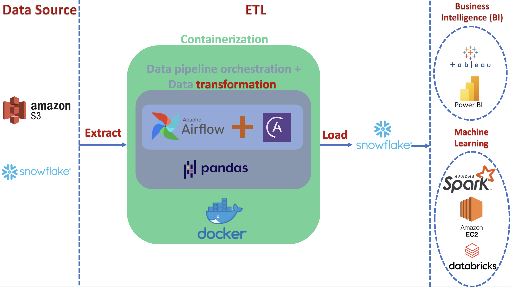

# Real_State_prices VS Average_Wages: predictions
The purpose of this project is to build a data pipeline to evaluate historical data regarding a global sample for the house prices index and average wages and predict the behavior of two measures for the following years.

## On-Going (Almost on step 4 [missing MLflow part])

## Project plan:
Project Steps:
### 1. Data Collection: 
- Obtain a dataset containing customer information, such as demographics, usage history, and churn labels. You can find publicly available datasets or create a synthetic dataset for this project.

### 2. Data Preprocessing with PySpark: 
- Use PySpark to perform data cleaning, transformation, and feature engineering on the raw data. This step may include handling missing values, encoding categorical features, scaling numeric features, and splitting the data into training and testing sets.

### 3. Machine Learning Model: 
- Choose a classification algorithm (e.g., logistic regression, random forest) to build a customer churn prediction model. Train and evaluate the model using PySpark, and use MLflow to log hyperparameters, metrics, and the trained model.

### 4. Airflow DAG Creation: 
- Create an Apache Airflow DAG (Directed Acyclic Graph) to orchestrate the entire data pipeline. Define tasks for each step of the pipeline, such as data ingestion, PySpark preprocessing, model training, and model evaluation.

### 5. Docker Containerization: 
- Containerize the entire data pipeline using Docker. Create separate Docker containers for the PySpark preprocessing, model training, and Airflow scheduler/worker components. This ensures easy deployment and scalability.

### 6. MLflow Integration: 
- Integrate MLflow into your project to track and manage model experiments and versions. Log all relevant information, including metrics, parameters, and the trained model, using MLflow's tracking server.

### 7. Deployment and Monitoring: 
- Deploy the Docker containers to a cloud-based environment (e.g., AWS, Google Cloud) or on-premises server. Implement monitoring and logging mechanisms to track the pipeline's performance and model drift over time.

### 8. API Endpoint: 
- Create a RESTful API endpoint using Flask or FastAPI to serve predictions using the trained model. This allows users to interact with the model in real-time.

### 9. Documentation and Testing: 
- Document the project thoroughly, including instructions for setting up and running the pipeline. Implement unit tests and integration tests to ensure the reliability of your pipeline.

### 10. Visualization: 
- Use tools like Matplotlib, Plotly, or Tableau to create visualizations that showcase the model's performance and insights from the data.